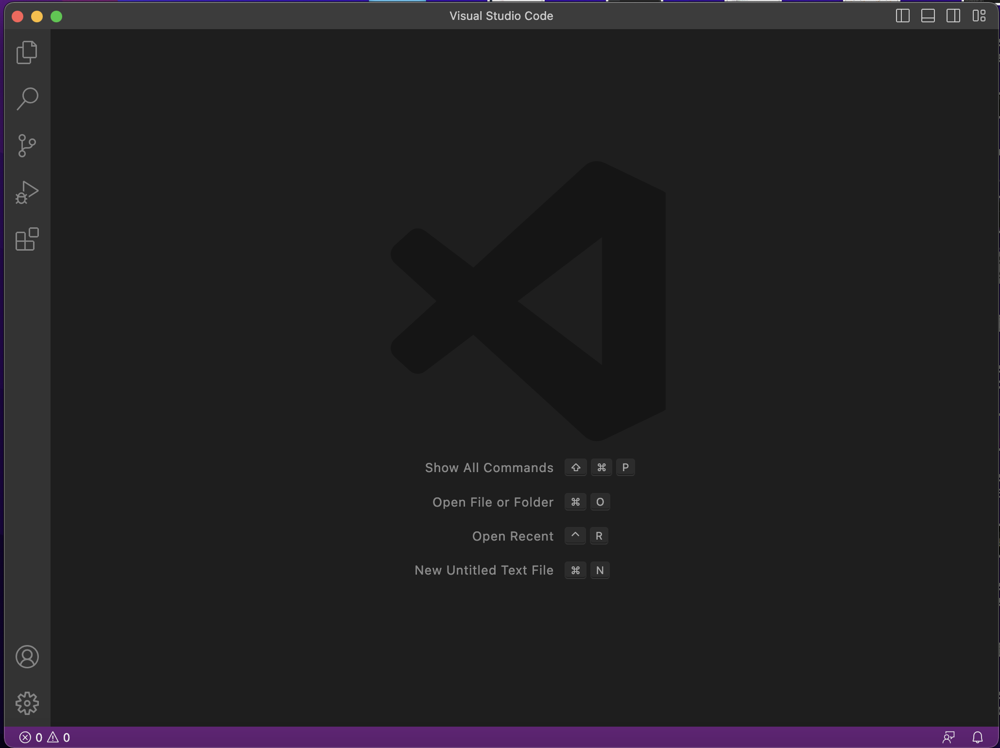
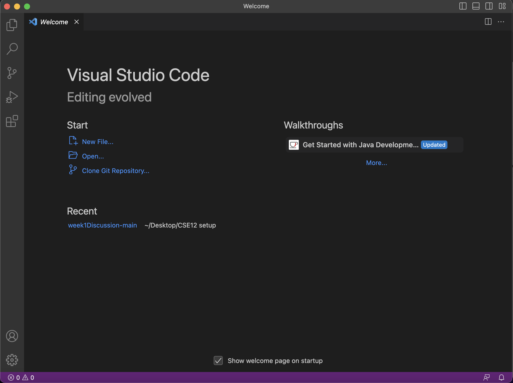
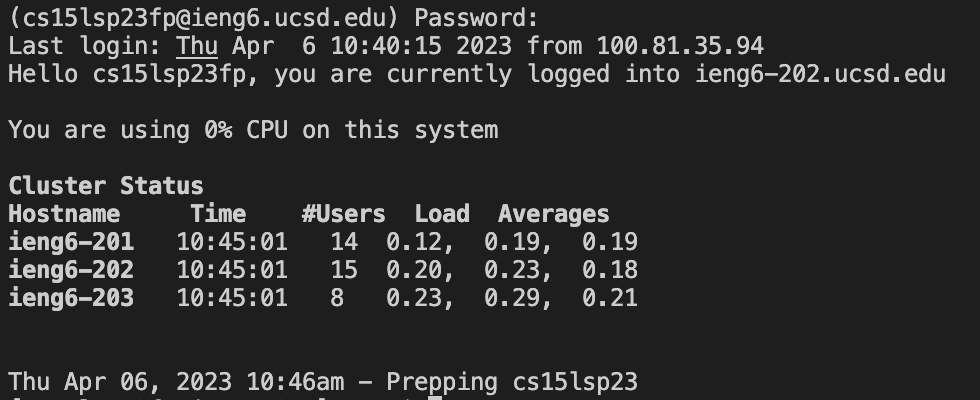
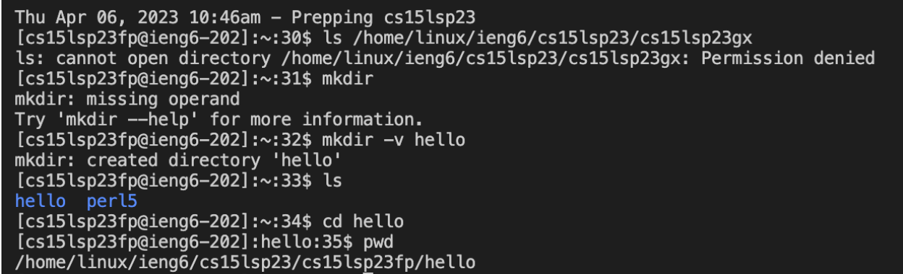

# Lab Report 1 - Remote Access and FileSystem (Week 1)
## VSCode installation
 
After downloading VSCode from the [official website](https://code.visualstudio.com/),follow the installation instructions and you should see a startup window similar to the screenshots above. Make sure to download VSCode for the correct operating system.

## Remotely Connecting 
Step 1. Open up a terminal window in VSCode by using the top menu (Terminal → New Terminal).  
Step 2. Type in the code `ssh cs15lsp23zz@ieng6.ucsd.edu`, replacing `zz` with your couse specific account and type in `yes` to the following prompt: 
```
The authenticity of host 'ieng6.ucsd.edu (128.54.70.227)' can't be established.
RSA key fingerprint is SHA256:ksruYwhnYH+sySHnHAtLUHngrPEyZTDl/1x99wUQcec
```

Are you sure you want to continue connecting (yes/no/[fingerprint])?`  
Step 3. Type in your password that you set from the [UCSD password-change website](https://sdacs.ucsd.edu/~icc/index.php). (Note that when you type in your password, symbols such as *** won't show up so hit enter again to reset if you made a mistake while typing your password)  

Step 4. After typing in your credentials, you should see an output similar if not the same as the screenshot above.  
Step 5. As soon as you see the line `Prepping cs15lsp23`, your remote console is ready!

## Trying Some Commands
You are now able to run commands such as:  
`cd ~`  
`cd`  
`ls -lat`  
`ls -a`  
`ls <directory> where <directory> is /home/linux/ieng6/cs15lsp23/cs15lsp23abc, where the abc is one of the other group members’ username`  
`cp /home/linux/ieng6/cs15lsp23/public/hello.txt ~/`  
`cat /home/linux/ieng6/cs15lsp23/public/hello.txt`  
For example, I ran a series of commands as shown below.

In the screenshot above, I:
  1. Tried accessing and listing directories from a peer but did not have permission.
  2. Created a new directory hello using mkdir -v. 
  3. Changed current directory to hello using cd, and checked by printing using pwd.
