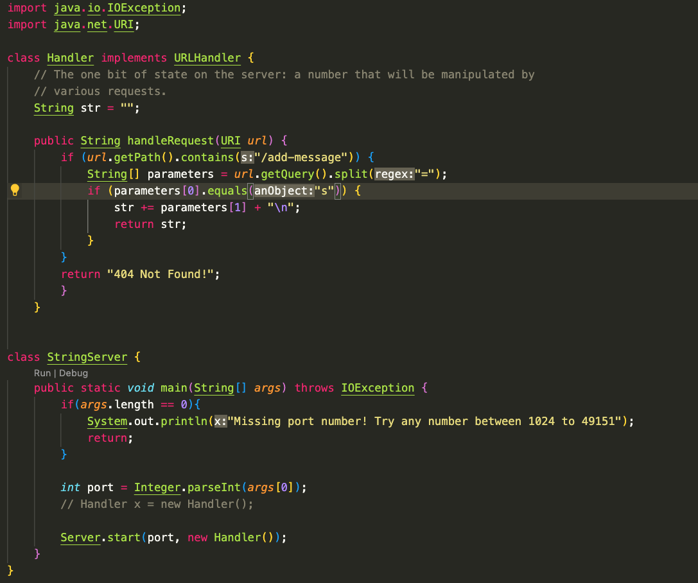
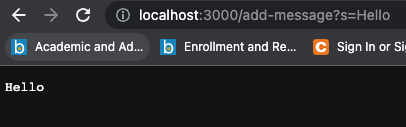
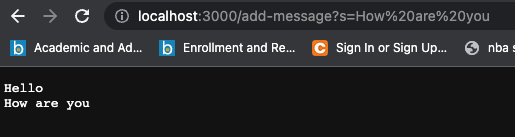

# Lab Report 2 - URLs and Servers/Debugging (Week 2/3)
## Part 1

After running the code
`javac Server.java`
`javac StringServer.java`
and `java StringServer 4000`
I was able to create a local server on the port 4000. The main method in StringServer is called first which then calls the handleRequest method in the Handler class. The handleRequest method takes the URL of the local server as input and passes it through an if-statement which checks if the path of the URL contains the command of `/add-message`, if so, the method splits the words of the query of the URL in to an array. All words after the element which will then be added to what will be printed on the server. The URL of the server basically determines what will be printed since it is split into an array of Strings. For examples, a URL of `http://localhost:4000/add-message?s=How are you` the "How are you" will be added to the output String which will be printed like below. The printed Strings will be saved even after a new command is ran.


## Part 2
In lab 3, I chose the `averageWithoutLowest()` method of the ArrayExample class to test/debug. This method is intended to calculate the average of an array of integers excluding the lowest number. However, after seeing this explanation, I wasn't completely sure about how the method body that was given to us will handle cases where there are multiple elements that are the lowest number, so I started testing using JUnit's assert methods.  

I first tested the case with an empty array which is expected to return 0.
```js
@Test
  public void testAverageWithoutLowestEmpty() {
    double[] input1 = {};
    double actual1 = ArrayExamples.averageWithoutLowest(input1);
    assertEquals("empty array", "0.00", String.format("%.2f", actual1));
  }  
```
Then I tested the case with an array of all unique elements `{1, 2, 3}` which is expected to return 2.5.
```js
@Test
  public void testAverageWithoutLowestUnique() {
    double[] input2 = {1, 2, 3};
    double actual2 = ArrayExamples.averageWithoutLowest(input4);
    assertEquals("three element array", "2.50", String.format("%.2f", actual2));
  }    
```
Both of these tests passed without a problem. So I tested the case where there are multiple elements in the array that are equal to the lowest number `{1, 1, 3}`.
```js
@Test
  public void testAverageWithoutLowestRepeatLowest() {
    double[] input3 = {1, 1, 3};
    double actual3 = ArrayExamples.averageWithoutLowest(input4);
    assertEquals("three element array", "3.00", String.format("%.2f", actual3));
  }    
```
This case failed, instead of returning 3.00, it returned 1.50. Then I started to examine the body of the method and realized that although the method excludes all instances of the lowest number when calculating the sum, there wasn't a way to count how many of the lowest numbers are removed from the array therefore messing up the denominator of the calculation of the average. To fix this, I implemented a counter that increments everytime a lowest number is excluded from the sum. Then, using this number, I was able to fix the problem where the denominator is larger than intended causing an error.

## Part 3
Having taken CSE8B, DSC30 and currently taking CSE12, I am pretty familiar with the concept of debugging using JUnit. However, in lab 2, I learned a lot about the significance of the URL of a server/webpage and, to an extent, which each part of the URL does what. I did quite a bit of coding but was never exposed to actually creating a server that other people can also access but now I know!
