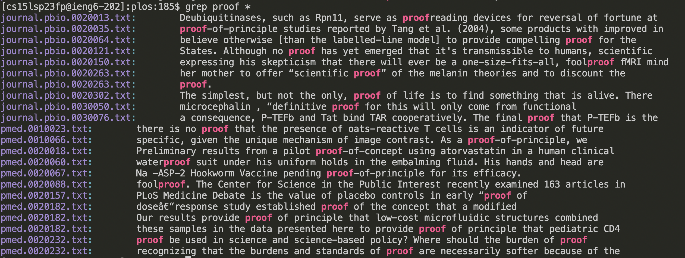

# Lab Report 3 - Researching Commands (Week 5)
## grep -w (whole word)
 

The command `grep -w` is a command-line option for `grep` that returns the lines containing the **specific word** as opposed to any word
containing the substring. In the images above, we can see that the second image (without -w) also shows lines with words such as 
"waterproof" and "foolproof" while the first image only shows lines with the word "proof".

Similarly, rather than showing the lines containing the word "accord" (both as a word or a substring), using `grep -w accord` on the file(s)
only shows lines with the word "accord" in it.

## grep -i (case insensitive)
 
 
The command `grep -i` returns all the lines within a file(s) that contains a specific substring, regardless of the casing. The original `grep`
command is case sensitive so calling the command `grep accord rr171.txt` will show the lines containing the substring "accord" and not 
including "Accord", "ACCORD", etc as shown in the first image. However, by adding `-i`, all lines containing the substring "accord" of any
casing will be returned (second image).

 
In the image above, we can tell the differences between the two commands is that the capital "For" in included in lines 2 and 4 in the 
output of `grep -i for pmed.0020281.txt` but is excluded in `grep for pmed.0020281.txt`.

## grep -r (search all subdirectories)

The command `grep -r` essentially runs `grep` on all files in the current directory and its subdirectories. We all know that `grep` takes in
a `.txt` file so when ran on a directory, `grep: ____: Is a directory`, will be returned as shown in the image above. However, running the
same command but with -r added will result in the output shown below.

In this image, we can see the file path of where the line containing the substring is found as well as the line itself.

## grep -v (exclude word)

`grep -v` can be understood as the opposite of regular `grep`. Instead of returning the line of where the entered substring is found, 
`grep -v` returns all the lines where the said substring is **not** found. An example can be seen below.

Another example can be seen below where `grep blower pmed.0020281.txt` and `grep -v blower pmed.0020281.txt` have the opposite output.

An additional remark is that all of these command-line options can be combined such as `grep -vi` returns all the lines where the inputted 
substring is **not** found (case insensitive). For example,

"
I was able to learn about these command-line options for the `grep` command from phoenixNAP's "How To Use grep Command In Linux/UNIX"
[article](https://phoenixnap.com/kb/grep-command-linux-unix-examples) (https://phoenixnap.com/kb/grep-command-linux-unix-examples).
