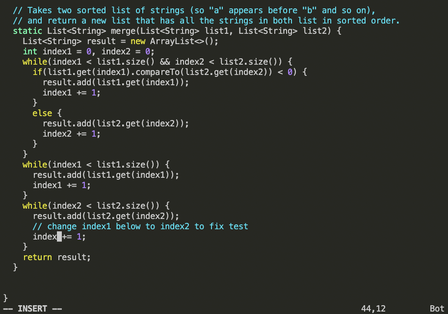

# Lab Report 4 - Doing it All From the Command Line (Week 7)
## Step 1

Keys pressed: `ssh cs15lsp23fp@ieng6.ucsd.edu`, \<enter\>
  
First, type in `ssh cs15lsp23fp@ieng6.ucsd.edu` to the command line in console. This line logs the user into the ieng6 remote server.

## Step 2

Keys pressed: `git clone git@github.com:hyc004/lab7.git`, \<enter\>

This command clones the forked repository from the user's github page to the remote server.

## Step 3

Keys pressed: `cd lab7`, \<enter\>, `bash test.sh`, \<enter\>

The first command changes the current directory to `lab7` where the rest of the required files are located. The second command runs the 
Junit tests on the file `ListExamples.java` from a pre-written script. We should see that there is a failure in the test output.

## Step 4

Keys pressed: `vim ListExamples.java`, \<enter\>

This command opens `ListExamples.java` in vim which allows us to perform the later steps. 

## Step 5

Keys pressed: `43j`
By typing `43j`, the cursor will move 43 lines downwards, from line 1 (default) to line 44 (where the bug is).

## Step 6

Keys pressed: `11l`

By typing `11l`, the cursor will move to the right by 11 characters, highlighting the number `1` in `index1`.

## Step 7

Keys pressed: `x`

Pressing `x` while the character `1` is highlighted will delete the character, resulting in the line being changed to `index += 1`.

## Step 8

Keys pressed: `i`

Pressing `i` will enter vim's insert mode, where the user can make edits to the file.

## Step 9

Keys pressed: `2`, \<esc\>, `:wq`

After entering insert mode, typing `2` will add the character `2` to where the cursor is (where the 1 was) so the newly editted line will
become `index2 += 1`. Pressing \<esc\> will exit insert mode. Typing `:wq` in normal mode will save the edits and quit vim.

## Step 10

Keys pressed: \<up\>, \<up\>, \<enter\>

Run the test again by going up in the bash history to find and run `bash test.sh`. We should see that all tests have passed.

## Step 11

Keys pressed: `git add ListExamples.java`, \<enter\>

This command will add the edits we made to `ListExamples.java` to the commit.

## Step 12

Keys pressed: `git status`, \<enter\>

This command allows us to check whether the our edit is successfully added to the commit.

## Step 13

Keys pressed: `git commit -m “updated ListExamples.java”`, \<enter\>

This command will commit our changes with a commit message that will be pushed.

## Step 14

Keys pressed: `git push -u origin main`, \<enter\>

This command pushes the commit to the user's github page.
