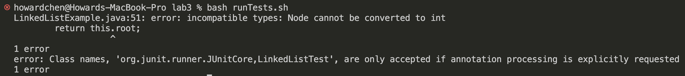
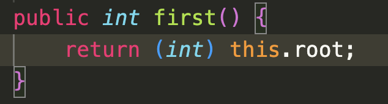
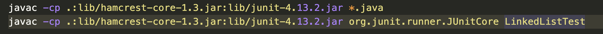
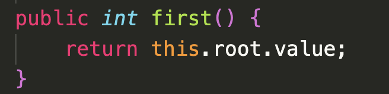
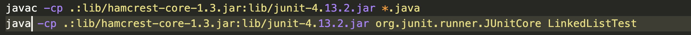

# Lab Report 5 -  (Week 9)
## Part 1 – Debugging Scenario
### Student Post
#### What environment are you using (computer, operating system, web browser, terminal/editor, and so on)?
Visual Studio Code on my own MacBook.

#### Detail the symptom you're seeing. Be specific; include both what you're seeing and what you expected to see instead. Screenshots are great, copy-pasted terminal output is also great. Avoid saying “it doesn't work”.
As I tried to run my script for compiling and running the test file on LinkedListExamples.java, 
I ran into an error shown in the screenshot below.

I am expecting the all tests in LinkedListTest.java to pass and show an output of `OK! (_ tests)` but wasn't able to get the test file running at all.
#### Detail the failure-inducing input and context. That might mean any or all of the command you're running, a test case, command-line arguments, working directory, even the last few commands you ran. Do your best to provide as much context as you can.
From the error message, I can see that the first part line pointing to my first() method in LinkedListExamples.java which I understand it to be returning a
type of integer which I believe I've addressed by type casting yet it still didn't seem to work. I have attached a screenshot below of my code for the method
first().
.png)

Additionally, I don't really understand the second line part of the error screenshot.

### TA Response
Hello ______, from your screenshots, I can give you a small hint for your first error. The method first(), as you've noted, returns an integer,
but what is the type of this.root? Why do you think type casting wouldn't work? What is and how do you get the "value" of this.root?

Regarding the second part of the screenshot, my guess is that the test file did not run at all. Did the test file successfully compile after fixing
the error above? How should you run a file that finished compiling? Maybe try typing directly to terminal and making sure the commands work as expected
before putting them into a script!

### Student fixes
#### Before

This code is attempting to change the type of a Node object (`this.root`) to an integer, which cannot be done causing a compiler error

The second line is trying to compile (javac) LinkedListTest.java with the command that is used to run the test file after compiling, 
resulting in the test case not being able to run at all.

#### After

The bug here is that the student is attempting to type cast a Node object to an integer rather than getting the value stored within the Node which causes
a compiler error. By using `this.root.value`, we made sure that it is the integer value that is being returned rather than the Node itself, hence preventing
the wrong code of explicit type casting.

The bug here is the simple mistake of trying to compile LinkedListTest.java (javac) rather than running (java) in the Junit command `org.junit.runner.JUnitCore`.
By replacing `javac` with `java`, the test file will run properly.

## Part 2- Reflection
I really enjoyed labs especially in week 7 where we got to mess around with `vim`. I found the built-in interactive vim tutorial to be very helpful and fun.
Additionally, week 6 and 8's lab was without a doubt the most challenging but also rewarding. Although I'm still facing some trouble writing bash code
effectively and efficiently, I was able to understand (to an extent) how an autograder works i.e. take in a file, check for a file, run tests, print score as output.
